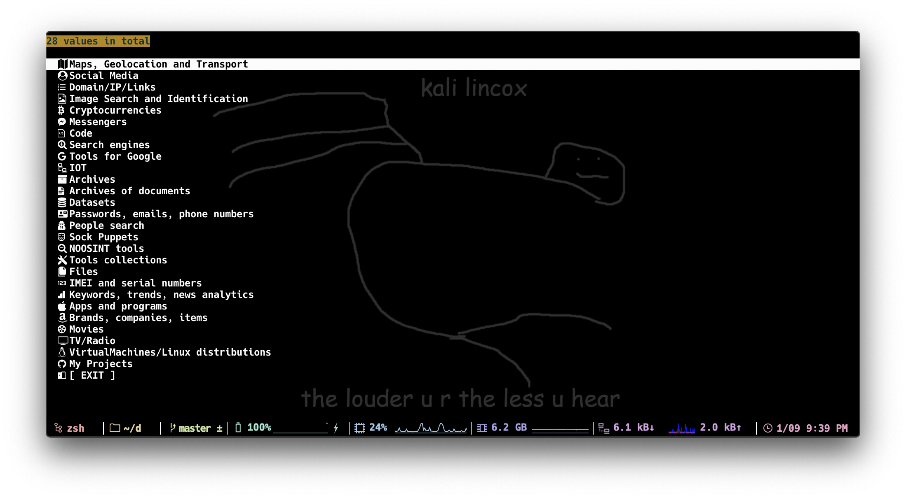

# OSINT-TOOLS-CLI


## ⚠️ SORRY IT'S NOT WORKING YET, BUT WE'RE DOING OUR BEST.



## WHATS THIS

THIS IS A CLI VERSION OF THE CHEAT SHEET FOR EASY ACCESS.
TABLE OF CONTENTS IS BASED ON [CIPHER387/OSINT_STUFF_TOOL_COLLECTION](HTTPS://GITHUB.COM/CIPHER387/OSINT_STUFF_TOOL_COLLECTION).  
IT CAN BE NAVIGATED WITHOUT USING COMMANDS OR THE CURSOR.

## ISSUES
⚠️IT WON'T WORK UNTIL THESE TWO ISUUES ARE COMPLETED.⚠️  
[LIST INSERTION #4](https://github.com/Coordinate-Cat/OSINT-TOOLS-CLI/issues/4)  
[COMMON FUNC #5](https://github.com/Coordinate-Cat/OSINT-TOOLS-CLI/issues/5)

### Progress

- [x] Maps, Geolocation and Transport
- [x] Social Media
- [ ] Domain/IP/Links
- [ ] Image Search and Identification
- [ ] Cryptocurrencies
- [ ] Messengers
- [ ] Code
- [ ] Search engines
- [ ] Tools for Google
- [ ] IOT
- [ ] Archives
- [ ] Archives of documents
- [ ] Datasets
- [ ] Passwords, emails, phone numbers
- [ ] People search
- [ ] Sock Puppets
- [ ] NOOSINT tools
- [ ] Tools collections
- [ ] Files
- [ ] IMEI and serial numbers
- [ ] Keywords, trends, news analytics
- [ ] Apps and programs
- [ ] Brands, companies, items
- [ ] Movies
- [ ] TV/Radio
- [ ] VirtualMachines/Linux distributions
- [ ] My Projects
## RESOURCE
- CIPHER387/OSINT_STUFF_TOOL_COLLECTION
  (HTTPS://GITHUB.COM/CIPHER387/OSINT_STUFF_TOOL_COLLECTION)

## USAGE

### ⚠️ Sorry, this doesn't work if you do the following. Please wait until readme.md is rewritten.

### 1.REPO
```
$ git clone git@github.com:Coordinate-Cat/OSINT-TOOLS-CLI.git
```

### 2.INTERNALLY DEPENDENT PACKAGES
> Copyright (c) 2014 rcmdnk  
[SENTAKU](https://github.com/rcmdnk/sentaku)
```
$ brew tap rcmdnk/rcmdnkpac
$ brew install sentaku
$ brew file install
```

### 3.GLOBAL VARIABLE
<!-- WRITE TO `~/.ZSHRC` OR `~/.BASHZRC` -->

`~/env.zsh` needs to be loaded in `.zshrc` or `.bashrc`  
<details>
<summary>env.zsh</summary>

```
# OSINT(TOC)
## TABLE OF CONTENTS
## Files without TITLE_ASCII. e.g.(osint.sh -> CHILD PAGE[EXIT] -> toc.sh)
export TOC="$HOME/OSINT-TOOLS-CLI/toc.sh"

# CHILD PAGE
export MAPS_GEOLOCATION_AND_TRANSPORT="$HOME/OSINT-TOOLS-CLI/bin/maps-geolocation-and-transport.sh"
export SOCIAL_MEDIA="$HOME/OSINT-TOOLS-CLI/bin/soccial-media.sh"

export DOMAIN_IP_LINKS="$HOME/OSINT-TOOLS-CLI/bin/domain-ip-links.sh"
export IMAGE_SEARCH_AND_IDENTIFICATION="$HOME/OSINT-TOOLS-CLI/bin/image-search-and-identification.sh"
export CRYPTOCURRENCIES="$HOME/OSINT-TOOLS-CLI/bin/cryptocurrencies.sh"
export MESSENGERS="$HOME/OSINT-TOOLS-CLI/bin/messengers.sh"
export CODE="$HOME/OSINT-TOOLS-CLI/bin/code.sh"
export SEARCH_ENGINES="$HOME/OSINT-TOOLS-CLI/bin/search-engines.sh"
export TOOLS_FOR_GOOGLE="$HOME/OSINT-TOOLS-CLI/bin/tools-for-google.sh"
export IOT="$HOME/OSINT-TOOLS-CLI/bin/iot.sh"
export ARCHIVES="$HOME/OSINT-TOOLS-CLI/bin/archives.sh"
export ARCHIVES_OF_DOCUMENTS="$HOME/OSINT-TOOLS-CLI/bin/archives-of-documents.sh"
export DATASETS="$HOME/OSINT-TOOLS-CLI/bin/datasets.sh"
export PASSWORDS_EMAILS_PHONE_NUMBERS="$HOME/OSINT-TOOLS-CLI/bin/passwords-emails-phone-numbers.sh"
export PEOPLE_SEARCH="$HOME/OSINT-TOOLS-CLI/bin/people-search.sh"
export SOCK_PUPPETS="$HOME/OSINT-TOOLS-CLI/bin/sock-puppets.sh"
export NOOSINT_TOOLS="$HOME/OSINT-TOOLS-CLI/bin/noosint-tools.sh"
export TOOLS_COLLECTIONS="$HOME/OSINT-TOOLS-CLI/bin/tools-collections.sh"
export FILES="$HOME/OSINT-TOOLS-CLI/bin/files.sh"
export IMEI_AND_SERIAL_NUMBERS="$HOME/OSINT-TOOLS-CLI/bin/imei-and_-serial-numbers.sh"
export KEYWORDS_TRENDS_NEWS_ANALYTICS="$HOME/OSINT-TOOLS-CLI/bin/keywords-trends-news-analytics.sh"
export APPS_AND_PROGRAMS="$HOME/OSINT-TOOLS-CLI/bin/apps-and-programs.sh"
export BRANDS_COMPANIES_ITEMS="$HOME/OSINT-TOOLS-CLI/bin/brands-companies-items.sh"
export MOVIES="$HOME/OSINT-TOOLS-CLI/bin/movies.sh"
export TV_RADIO="$HOME/OSINT-TOOLS-CLI/bin/tv-radio.sh"
export VIRTUALMACHINES_LINUX_DISTRIBUTIONS="$HOME/OSINT-TOOLS-CLI/bin/virtualmachines-linux-distributions.sh"
export MY_PROJECTS="$HOME/OSINT-TOOLS-CLI/bin/my-projects.sh"

# OSINT/MAPS_GEOLOCATION_AND_TRANSPORT
export SOCIAL_MEDIA_AND_PHOTOS_MAPS="$HOME/OSINT-TOOLS-CLI/bin/MAPS_GEOLOCATION_AND_TRANSPORT/social-media-and-photos-maps.sh"
export NATURE_AVIATION="$HOME/OSINT-TOOLS-CLI/bin/MAPS_GEOLOCATION_AND_TRANSPORT/nature-aviation.sh"
export MARITIME="$HOME/OSINT-TOOLS-CLI/bin/MAPS_GEOLOCATION_AND_TRANSPORT/maritime.sh"
export RAILWAY="$HOME/OSINT-TOOLS-CLI/bin/MAPS_GEOLOCATION_AND_TRANSPORT/railway.sh"
export ROUTES="$HOME/OSINT-TOOLS-CLI/bin/MAPS_GEOLOCATION_AND_TRANSPORT/routes.sh"
export POLITICS_CONFLICTS_AND_CRISIS="$HOME/OSINT-TOOLS-CLI/bin/MAPS_GEOLOCATION_AND_TRANSPORT/politics-conflicts-and-crisis.sh"
export URBAN_AND_INDUSTRIAL_INFRASTRUCTURE="$HOME/OSINT-TOOLS-CLI/bin/MAPS_GEOLOCATION_AND_TRANSPORT/urban-and-industrial-infrastructure.sh"
export TRANSPORT="$HOME/OSINT-TOOLS-CLI/bin/MAPS_GEOLOCATION_AND_TRANSPORT/transport.sh"
export COMMUNICATIONS_INTERNET_TECHNOLOGIES="$HOME/OSINT-TOOLS-CLI/bin/MAPS_GEOLOCATION_AND_TRANSPORT/communications-Internet-technologies.sh"
export TOOLS="$HOME/OSINT-TOOLS-CLI/bin/MAPS_GEOLOCATION_AND_TRANSPORT/tools.sh"
export STREET_VIEW="$HOME/OSINT-TOOLS-CLI/bin/MAPS_GEOLOCATION_AND_TRANSPORT/street-view.sh"
export OTHER="$HOME/OSINT-TOOLS-CLI/bin/MAPS_GEOLOCATION_AND_TRANSPORT/other.sh"

# OSINT/SOCIAL_MEDIA
export TWITTER="$HOME/OSINT-TOOLS-CLI/bin/SOCIAL_MEDIA/twitter.sh"
export YOUTUBE="$HOME/OSINT-TOOLS-CLI/bin/SOCIAL_MEDIA/youtube.sh"
```
</details>

#### 3-1.EXPORT & SOURCE
DESCRIBE IT ON `.zshrc` OR `.bashrc`
```
export OSINTDIR="$HOME/OSINT-TOOLS-CLI"
source $OSINTDIR/env.zsh
```

#### 3-2.LOAD
```
$ source ~/.zshrc
or
$ source ~/.bashrc
```

### 4.ALIAS
PASS THE PATH TO WHERE YOU DOWNLOADED IT.  
`osint.sh` WILL LAUNCH THE CLI.
```
alias osint='zsh $HOME/OSINT-TOOLS-CLI/osint.sh'
```

### 5.DISPLAY THE ICON
HACK NERD FONT  
- [SITE URL](https://www.nerdfonts.com/font-downloads)  
- [DIRECT DOWNLOAD](https://github.com/ryanoasis/nerd-fonts/releases/download/v2.1.0/Hack.zip)

## DEVELOPMENT SIDE ENVIRONMENT

- MACOS CATALINA OR BIGSUR
- ITERM2